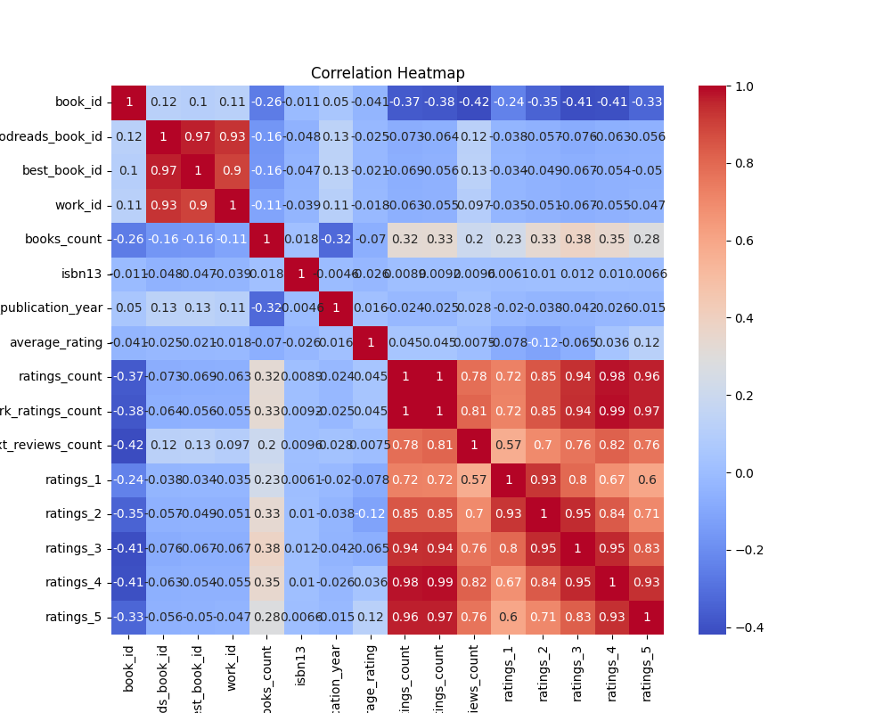

# Automated Analysis

## Summary
### Columns:
book_id, goodreads_book_id, best_book_id, work_id, books_count, isbn, isbn13, authors, original_publication_year, original_title, title, language_code, average_rating, ratings_count, work_ratings_count, work_text_reviews_count, ratings_1, ratings_2, ratings_3, ratings_4, ratings_5, image_url, small_image_url

### Missing Values:
- book_id: 0
- goodreads_book_id: 0
- best_book_id: 0
- work_id: 0
- books_count: 0
- isbn: 700
- isbn13: 585
- authors: 0
- original_publication_year: 21
- original_title: 585
- title: 0
- language_code: 1084
- average_rating: 0
- ratings_count: 0
- work_ratings_count: 0
- work_text_reviews_count: 0
- ratings_1: 0
- ratings_2: 0
- ratings_3: 0
- ratings_4: 0
- ratings_5: 0
- image_url: 0
- small_image_url: 0

### Visualizations

